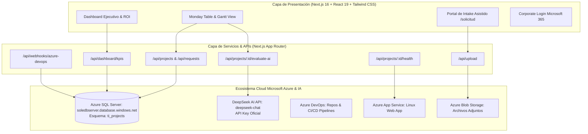

# 🏗️ DOCUMENTO DE ARQUITECTURA TÉCNICA (DAT / SDD)
**Plataforma:** TI Innovation Portal  
**Empresa:** Grupo Sole (Corporación Rinnai / MT Industrial S.A.C.)  
**Versión:** 1.0 (Producción)  
**Fecha:** Septiembre 2026  

---

## 1. Arquitectura General de la Solución

---

## 2. Stack Tecnológico

| Capa | Tecnología | Versión | Propósito |
| :--- | :--- | :--- | :--- |
| **Framework Web** | Next.js (App Router & Turbopack) | 16.3.3 | Renderizado híbrido SSR/CSR y Server Actions |
| **Biblioteca UI** | React | 19.x | Componentes reactivos desacoplados |
| **Tipado Estático** | TypeScript | 5.x | Tipado estricto de extremo a extremo |
| **Estilos & CSS** | Tailwind CSS con PostCSS | 4.x | Diseño responsive e identidad visual institucional |
| **Iconografía** | Lucide React | 1.16+ | Iconos vectoriales limpios (cero emojis) |
| **Base de Datos** | Azure SQL Server Database | v12.0 | Persistencia relacional ACID en la nube |
| **Conector SQL** | `mssql` / Prisma ORM | Native Pool | Pool de conexiones seguras cifradas con TLS |
| **Motor de IA** | DeepSeek AI (`deepseek-chat`) | API v1 | Evaluación de requerimientos y auditoría de repositorios |
| **Exportación** | SheetJS (`xlsx`) | 0.18.5 | Generación de archivos Excel multilibro nativos |
| **CI/CD** | Azure DevOps Pipelines | YAML | Compilación y despliegue continuo automatizado |

---

## 3. Modelo de Datos y Esquema Azure SQL Server (`ti_projects`)

La base de datos `soledb-puntoventa` aloja el esquema aislado **`ti_projects`** con las siguientes tablas:

### 3.1. Tabla: `ti_projects.Projects`
* `id` (VARCHAR(64), PK): Identificador único UUID.
* `code` (VARCHAR(32), UNIQUE): Código corporativo (ej. `IA-2026-001`).
* `name` (NVARCHAR(255)): Nombre del proyecto.
* `description` (NVARCHAR(MAX)): Descripción técnica y de negocio.
* `category` (VARCHAR(64)): `AI_GENAI`, `AUTOMATION_RPA`, `WEB_PORTAL`, `DATA_BI`, `API_INTEGRATION`, `OTHER`.
* `status` (VARCHAR(32)): `BACKLOG`, `DISCOVERY`, `IN_PROGRESS`, `UAT_TESTING`, `DEPLOYED`, `CANCELLED`.
* `solutionType` (VARCHAR(64)): `NEW_SOLUTION`, `INTEGRATION_EXISTING`.
* `targetSystems` (NVARCHAR(MAX)): JSON Array con sistemas (*SAP, C4C, Beetrack, etc.*).
* `requesterName` (NVARCHAR(128)): Nombre del solicitante.
* `requesterEmail` (VARCHAR(128)): Correo institucional.
* `requesterDepartment` (NVARCHAR(128)): Departamento de la empresa.
* `specialistName` (NVARCHAR(128)): Especialista de TI asignado.
* `startDate` (DATE): Fecha de inicio programada.
* `targetEndDate` (DATE): Fecha de fin programada.
* `savedHoursMonth` (FLOAT): Horas de trabajo ahorradas al mes.
* `hourlyRate` (FLOAT): Tarifa horaria base ($18 USD).
* `savedMoneyMonth` (FLOAT): Ahorro económico mensual ($).
* `manualProgress` (INT): Porcentaje de avance manual (0 a 100).
* `aiEstimatedProgress` (INT): Porcentaje de avance calculado por DeepSeek.
* `aiProgressAnalysis` (NVARCHAR(MAX)): Feedback de auditoría de IA.
* `repositoryUrl` (NVARCHAR(512)): Enlace al repositorio de Azure Repos.
* `deploymentUrl` (NVARCHAR(512)): Enlace a la Azure Web App en producción.
* `createdAt` (DATETIME2), `updatedAt` (DATETIME2).

### 3.2. Tabla: `ti_projects.Requests`
* `id` (VARCHAR(64), PK), `code` (VARCHAR(32)), `title` (NVARCHAR(255)), `description` (NVARCHAR(MAX)), `businessPain` (NVARCHAR(MAX)), `urgency` (VARCHAR(32)), `status` (VARCHAR(32)), `solutionType` (VARCHAR(64)), `targetSystems` (NVARCHAR(MAX)), `attachments` (NVARCHAR(MAX) JSON), `createdAt` (DATETIME2).

### 3.3. Tabla: `ti_projects.Tasks`
* `id` (VARCHAR(64), PK), `projectId` (VARCHAR(64), FK), `title` (NVARCHAR(255)), `isCompleted` (BIT), `createdAt` (DATETIME2).

### 3.4. Tabla: `ti_projects.ProjectNotes`
* `id` (VARCHAR(64), PK), `projectId` (VARCHAR(64), FK), `title` (NVARCHAR(255)), `content` (NVARCHAR(MAX)), `author` (NVARCHAR(128)), `createdAt` (DATETIME2).

---

## 4. Endpoints de la API REST

| Método | Endpoint | Descripción |
| :--- | :--- | :--- |
| `GET` | `/api/dashboard/kpis` | Retorna los KPIs ejecutivos, ROI financiero y lista completa de proyectos. |
| `GET` | `/api/projects` | Lista todos los proyectos con filtros de búsqueda y categoría. |
| `POST` | `/api/projects` | Crea un nuevo proyecto en Azure SQL Server. |
| `PUT` | `/api/projects/:id` | Actualiza atributos, estado o fechas de un proyecto. |
| `POST` | `/api/projects/:id/evaluate-ai` | Envía notas de código a DeepSeek AI para auditoría técnica. |
| `GET` | `/api/projects/:id/health` | Ejecuta un ping de health-check a la Azure Web App asociada. |
| `GET` | `/api/requests` | Lista todas las solicitudes de intake registradas. |
| `POST` | `/api/requests` | Registra una nueva solicitud desde el portal de usuarios. |
| `POST` | `/api/requests/:id/convert` | Transforma una solicitud aprobada en un proyecto oficial. |
| `POST` | `/api/upload` | Sube y almacena un archivo adjunto (Excel, PDF, imagen). |
| `POST` | `/api/webhooks/azure-devops` | Receptor de eventos CI/CD y commits desde Azure DevOps. |
